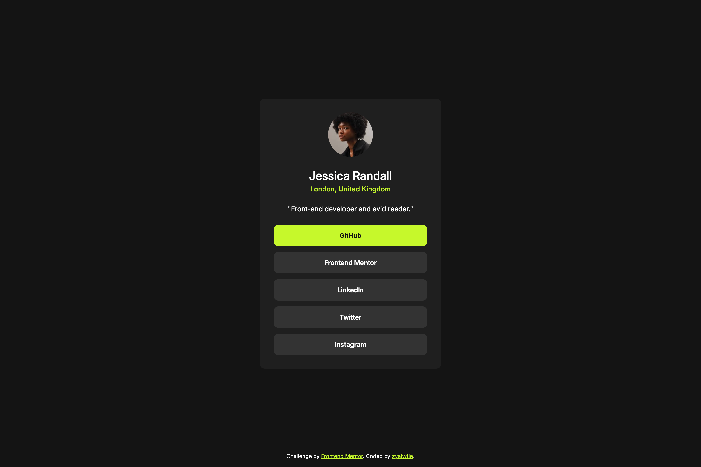

# Frontend Mentor - Social links profile solution


This is a solution to the [Social links profile challenge on Frontend Mentor](https://www.frontendmentor.io/challenges/social-links-profile-UG32l9m6dQ). Frontend Mentor challenges help you improve your coding skills by building realistic projects.

## Table of contents

- [Frontend Mentor - Social links profile solution](#frontend-mentor---social-links-profile-solution)
  - [Table of contents](#table-of-contents)
  - [Overview](#overview)
    - [The challenge](#the-challenge)
    - [Screenshot](#screenshot)
    - [Links](#links)
  - [My process](#my-process)
    - [Built with](#built-with)
    - [What I learned](#what-i-learned)
  - [Author](#author)

## Overview

### The challenge

Users should be able to:

-   See hover and focus states for all interactive elements on the page

### Screenshot



### Links

-   Solution URL: [This repo](https://your-solution-url.com)
-   Live Site URL: [GitHub Pages](https://your-live-site-url.com)

## My process

### Built with

-   Semantic HTML5 markup
-   CSS custom properties
-   Flexbox
-   Mobile-first workflow

### What I learned

I can better understand how to define a container and analyze which elements should be grouped into it, under a small snippet of code from one of the containers:

```css
main article {
	width: 372px;
	background-color: var(--grey-800);
	padding: 28px;
	margin-inline: 24px;
	color: var(--white);
	display: flex;
	flex-direction: column;
	align-items: center;
	gap: 24px;
	border-radius: 10px;
}
```

## Author

-   Website - [zyalwfie](https://www.zyalwfie.com)
-   Frontend Mentor - [@zyalwfie](https://www.frontendmentor.io/profile/zyalwfie)
